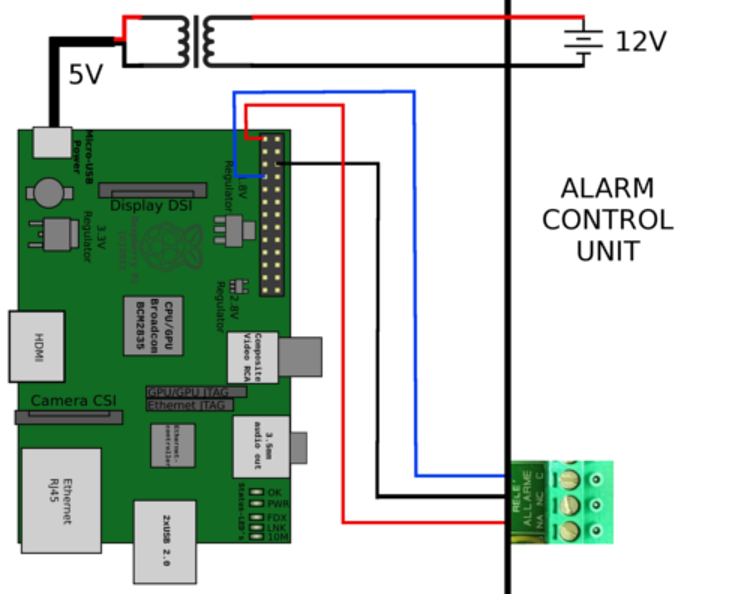

# IoT Home alarm system #

Following this example you can understand how to convert your home's old wired alarm with a pre-recorded phone notification to a new IoT system.

The problem: I want to remove my home's landline phone. How can I continue to use my home's wired alarm and still get a notification when the alarm is triggered without the need to receive a phone call?

What you need?

1. Some electrician skills, a multimeter, screwdrivers
2. Internet connection
3. Your smartphone
4. Working Raspberry Pi
5. An [AWS](https://aws.amazon.com/) account
6. An [IFTTT](https://ifttt.com/) account

### General description ###

**Step 1:** The idea is to connect the control unit of your home alarm platform to a GPIO of your Raspberry Pi. In this way when your alarm will be triggered, the GPIO will collect a signal that can be used to notify your mobile phone.

**Step 2:** Now how to make your Pi notify your Android mobile? Through your IFTTT account, you can configure an applet to receive the HTTP request and send a push notification to the IFTTT app in your mobile. 

**Step 3:** This already looks very nice, but last and not least, how to monitor that your Pi is always working correctly? Using the Amazon AWS free plan you can tell your Pi to send an alive signal that will checked from a cronned lambda expression. In case of failure a KO notification will be sent.

### Phase 1 - Identify a pin! ###
The first thing you need to do is open your home's alarm control unit and identify where to connect your Pi. You need to identify a pin which emits signal when your alarm detects an intrusion. 

Make some tests, starting from the siren connector. Once you have identified a correct signal, connect it to the Pi and proceed with the next steps.

Below you can see my own connection as an example.



### Phase 2 - Configure [IFTTT](https://ifttt.com/) Applet ###
Configure IFTTT to send notification to your [Android](https://play.google.com/store/apps/details?id=com.ifttt.ifttt&hl=it)/[IOS](https://itunes.apple.com/it/app/ifttt/id660944635?mt=8) mobile phone.

You have to install the IFTTT app on all the devices which you want to receive the notification. Once you have those installed, create an IFTTT account for each user. 

After a successful login, you need to configure two new [Applets](https://ifttt.com/my_applets), one for the alarm notification, and one for the software KO notification which will be sent if your Pi goes down.

To configure an applet, click on the new Applet button and choose **Webhooks** for the if section, and **Notifications** for then section.
Follow the applet creation steps, and set the text of the notification you want to recive. Then pick up the generated webhook URL that you will need in Setup Pi phase.


### Phase 3 - Setup [AWS](https://aws.amazon.com/), [DynamoDB](https://aws.amazon.com/en/dynamodb/?hp=tile&so-exp=below) and [Lambda expression](https://aws.amazon.com/en/lambda/?nc2=h_m1) ###
To check the status of your new IoT alarm you need to configure two Amazon AWS services.

*(Don't worry, for the purpouse of this project you don't have to pay anything. AWS Lambda and DynamoDB have free tiers under a certain range of usage).*

*[AWS Lambda pricing](https://aws.amazon.com/en/lambda/pricing/)*

*[AWS DynamoDB pricing](https://aws.amazon.com/en/dynamodb/pricing/)*

**STEP ONE:** Enter in your AWS account and open DynamoDB section. You need to create a simple table with just one field. You can perform this operation using AWS console.

I've created a simple table with just two fields: one identifies the building, the other will contain the event timestamp.
We'll understand later who set this data.

Example:

```
{
  "building": "MyHome",
  "lastPing": {
      "ts": 1533381549565
  }
}
```

**STEP TWO:** From your AWS console you also need to configure a Lambda expression. 
This function will check every 20 mins if your Pi has pushed into the DynamoDB database an updated timestamp.

If the value has not been updated since last check, we may assume that the Pi has lost power or connection, so we will push a notification to the configured mobile devices.

From the Lambda console click on **new function**, select [Node.js](https://nodejs.org/), than click **create function**. 
You can copy the code from the provided _lambda.js_ file or if you prefer, write your own version. 
After submitting your code, schedule your lambda to run on a schedule, i chose to run mine every 20mins.

*Keep in mind that if you run the lambda too frequently you may need a premium plan on AWS*

P.S. To make Lambda and Pi access DynamoDB you have to configure your account and roles. You can search on Amazon documentation how to do it. Enjoy!

### Phase 4 - Setup the rPI ###
This phase's main difficulty lays in how to detect the signal through GPIO and send it to the IFTTT back-end. 

For this purpose i used a low level [GPIO library](https://github.com/fivdi/onoff), with a [Node.js](https://nodejs.org/) script. 
The script is listening for events coming from pin 4, when an event is detected, it sends an HTTP request to all the addresses configured into the `addresses.json` file.

To monitor your Pi, you can find instructions below at point 4. The script pushes the current timestamp into the DynamoDB table you created earlier.

How to make this work:

0. Install [NPM](https://www.npmjs.com/) and [Node.js](https://nodejs.org/)
1. Move to the folder that contains main.js and package.json and execute ```npm install```
2. Setup the notification URL
    1. Open the `addresses.json` file
    2. Create an object inside the array for each user you want to be notified
    3. Put in the **url** field the address of the IFTTT webhook you created, and in the name field the name of the person that will be notified (for logging purposes only)
    4. Save and exit
3. Setup main script
    1. Copy the `main.js` file from this repository into your Pi home directory
    2. Setup a [cron](https://en.wikipedia.org/wiki/Cron) expression to run the script at boot. This will help you in case of your Pi rebooting or losing power, since it will run the script automatically on reboot.

    example: 
    `@reboot sudo /home/user/.nvm/versions/node/v8.11.1/bin/node /home/user/js/main.js >> /home/user/log/alarm_js.log 2>&1`

4. Setup keepalive script
    1. Copy the `lambda.js` script into your Pi home.
    2. Open the file with a text editor
    3. Configure the AWS region you chose for your table, the table name and the IFTTT webhook URL.
    4. Save and exit
    5. Put also the `lambda.js` script under cron expression

The Pi setup is completed! Let's test it!

### Hardware ###

I used a Raspberry Pi 1 model B, but you can choose a newer one. The only thing that changes in this project is GPIO pin to use.
About Pi's OS, i'm running on [Raspbian](https://www.raspberrypi.org/downloads/raspbian/) that is a simple basic distro, but you may use the one you prefer.

Useful links:

[Pi](https://www.amazon.com/Raspberry-PI-Model-Scheda-madre/dp/B01CD5VC92/ref=sr_1_7?ie=UTF8&qid=1533383850&sr=8-7&keywords=raspberry)

[MicroSD](https://www.amazon.it/gp/product/B073K14CVB/ref=oh_aui_detailpage_o01_s00?ie=UTF8&psc=1)

[Connection wire](https://www.amazon.it/gp/product/B01N40EK6M/ref=oh_aui_detailpage_o06_s00?ie=UTF8&psc=1)

To make the system more secure, I connected the Pi's power plug to the alarm's own 12V battery using a mobile phone car adapter. This is the easiest way to transform 12V into the 5V needed to power the Pi.
In this way if your home loses power, your alarm will still be alive and rocking!

**Keep attention that the USB charger you chose is powerful enough for your Pi. The rPI 1 needs at least 2A to work consistently (3A in case of rPI 3 or newer). If you use a tablet charger (2A or more) you should have no problems.**
    
[USB Charger](https://www.amazon.com/AUKEY-Charger-Output-iPhone-Samsung/dp/B00M6QODH2/ref=sr_1_15?ie=UTF8&qid=1533384251&sr=8-15&keywords=mobile+car+charger)